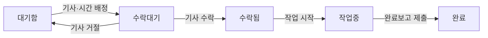

# 오빗 유즈케이스 분리안

- 상태: 피그마 기반 검토 초안
- 검토일: 2026-09-12
- 기준 자료: [Design.v0 — Manyfast 페이지](https://www.figma.com/design/5K4KURRdWETTXsnlurK6jK/Design.v0?node-id=13-2)
- 확인 범위: 관리자 웹 S1~S6, 기사 모바일 MS1~MS5, 각 화면의 Spec

이 문서는 피그마에서 확인한 사용자 흐름을 바탕으로 유즈케이스와 모듈 경계를 제안한다. 현재 구현이나 확정된 제품 정책을 설명하는 문서가 아니다. 화면과 Spec 사이의 충돌은 별도로 기록하며, 해당 정책을 확정한 뒤 구현 계약에 반영한다.

## 1. 분리 기준

유즈케이스는 **사용자가 끝내려는 업무와 함께 성공·실패해야 하는 상태 변경**을 기준으로 나눈다.

- 웹과 모바일이 같은 업무를 수행하면 공통 유즈케이스를 사용한다.
- 타임테이블·작업 목록·진행 보드는 같은 작업 데이터를 사용하되, 조회 결과는 화면 목적에 맞게 구성한다.
- 일반 정보 수정과 배정·일정·상태 변경은 권한과 검증 조건이 다르므로 분리한다.
- 경고·확인 모달과 오류 화면은 관련 유즈케이스의 대체 흐름 또는 예외 흐름으로 취급한다.
- 화면의 메뉴 위치보다 데이터와 업무 규칙의 소유 책임을 기준으로 모듈을 정한다.

## 2. 행위자와 권한

| 행위자 | 주요 업무 | 설계 시 확인할 사항 |
| --- | --- | --- |
| 미가입·미소속 사용자 | 인증, 가입 완료, 초대 확인·수락, 발주사 생성 | 소속이 없는 상태에서 허용할 기능 |
| 총관리자 | 발주사·인력·유형 관리, 총관리자 위임 | 조직당 총관리자 유지 조건, 탈퇴 제한 |
| 관리자·직원 | 작업 등록·배정·수정·취소, 현황 조회 | 역할별 실제 허용 작업과 등록자 제한 |
| 기사 | 배정 수락·거절, 작업 시작, 완료보고, 일정·이력 조회 | 본인 작업 조작, 타 기사 작업 열람 범위 |
| 시스템 | 업무 변경에 따른 알림 생성·전달, 실시간 갱신 전달 | 전달 실패 시 재처리와 중복 처리 정책 |

직원과 기사는 별도 계정보다 **사용자의 발주사별 소속과 역할**로 모델링하는 것을 제안한다. 다중 소속을 허용한다면 같은 사용자가 A사에서는 직원, B사에서는 기사일 수 있다. 다중 소속 허용 여부와 직원 유형이 권한을 결정하는지는 아직 확인이 필요하다.

## 3. 모듈별 유즈케이스

`user`, `organization`, `invitation`, `work`, `notification`의 5개 비즈니스 모듈을 제안한다. 아래 각 행의 행동은 개별 유즈케이스 후보이며, 한 행을 하나의 서비스로 구현한다는 의미는 아니다.

| 기능 영역 | 주요 유즈케이스 | 소유 모듈 |
| --- | --- | --- |
| 인증·계정 | 로그인, 로그아웃, 프로필·약관 입력 후 가입 완료, 내 정보 조회·수정, 탈퇴 | `user` |
| 발주사 관리 | 발주사 생성, 정보 조회·수정, 총관리자 위임 | `organization` |
| 인력 관리 | 직원·기사 목록 조회, 구성원 유형 변경, 활성화·비활성화 | `organization` |
| 유형 관리 | 직원·기사·작업 유형 조회, 추가, 수정, 삭제·비활성화 | `organization` |
| 초대 | 초대 발급, 재발급, 초대 정보 확인, 수락, 거절 | `invitation` |
| 작업 운영 | 작업 등록·수정, 기사 배정·재배정, 일정 변경, 배정 해제, 취소 | `work` |
| 현장 수행·보고 | 배정 수락, 배정 거절, 작업 시작, 완료보고 제출, 보고·이력 조회 | `work` |
| 알림 | 알림 목록·미읽음 수 조회, 읽음 처리, 알림 설정 변경 | `notification` |

### 모듈 경계에서 지킬 점

- `user`는 계정과 개인 프로필을, `organization`은 발주사별 소속·역할·활성 상태를 소유한다.
- `invitation`은 초대의 유효기간·재발급·사용 상태를 소유하고, 수락 시 `organization`의 공개 계약으로 소속을 생성한다. 초대 소비와 소속 생성의 일관성을 보장해야 한다.
- `work`는 작업·배정·수행 이력·완료보고를 소유한다. 조직 설정 화면에서 진입하는 기사 작업이력도 `work`의 책임이다.
- 총관리자 위임은 대상자 검증과 기존·신규 총관리자의 권한 변경이 함께 성공·실패해야 한다.
- 탈퇴는 계정 삭제뿐 아니라 소속 해제, 총관리자 여부, 미완료 작업 등 관련 모듈의 조건을 조정하는 흐름이다. 모듈 간 공개 계약을 통해 처리하며 데이터 보관 정책을 먼저 확정한다.
- 알림 생성·전달과 실시간 갱신은 업무 변경 이후의 후속 처리로 연결한다. 사용자가 보는 알림 목록과 실시간 화면 갱신은 별개의 책임이다.

## 4. 작업 변경 유즈케이스

기준 화면: [웹 타임테이블](https://www.figma.com/design/5K4KURRdWETTXsnlurK6jK/Design.v0?node-id=13-515), [모바일 작업 수행](https://www.figma.com/design/5K4KURRdWETTXsnlurK6jK/Design.v0?node-id=151-802).

| 유즈케이스 예시 | 수행 주체 | 함께 처리할 내용 |
| --- | --- | --- |
| `CreateWorkUseCase` | 작업 등록 권한자 | 작업 정보 저장. 기사·시간 미정 등록을 지원한다면 대기함에 표시 |
| `UpdateWorkDetailsUseCase` | 작업 수정 권한자 | 고객·현장·작업 내용·요금 등 일반 정보 수정 |
| `AssignWorkUseCase` | 배정 권한자 | 기사·시간 지정, 배정 가능 여부와 일정 충돌 검사, 수락대기로 전환 |
| `ReassignWorkUseCase` | 배정 권한자 | 기존 배정 종료, 새 기사 배정, 이전 배정 이력 보존 |
| `RescheduleWorkUseCase` | 일정 수정 권한자 | 시간 변경, 충돌 재검사, 변경 이력 기록 |
| `UnassignWorkUseCase` | 배정 권한자 | 배정 해제 후 대기함으로 반환. 작업중·완료는 차단 |
| `AcceptAssignmentUseCase` | 배정받은 기사 | 현재 유효한 본인 배정인지 확인하고 수락 |
| `RejectAssignmentUseCase` | 배정받은 기사 | 거절 사유 저장, 기존 배정 종료, 작업을 대기함으로 반환 |
| `StartWorkUseCase` | 담당 기사 | 수락된 본인 작업을 작업중으로 전환하고 시작 시각 기록 |
| `SubmitCompletionReportUseCase` | 담당 기사 | 사진·메모 등 보고 저장과 작업 완료 전환을 함께 처리 |
| `CancelWorkUseCase` | 취소 권한자 | 취소 사유·시각·처리자 기록, 이후 작업 수행 차단 |
| `CorrectWorkStatusUseCase` | 허용된 관리자 | 관리자 강제 변경을 별도 처리하고 변경 전후 상태·사유 기록 |

### 일관성과 예외 처리

- **완료보고 저장과 작업 완료 전환은 하나의 유즈케이스에서 함께 성공·실패해야 한다.** 사진 업로드는 먼저 수행할 수 있지만, 보고 제출에 실패했는데 작업만 완료되는 상태는 막는다.
- 피그마의 완료보고 Spec은 제출 후 수정 불가를 명시한다. 관리자 강제 상태 변경이 기존 완료보고에 미치는 영향과 재작성 절차는 추가 정의가 필요하다.
- 일정 충돌은 동일 기사의 기존 작업 시간 구간과 겹치는 경우를 검사한다. 피그마에는 충돌 확인 후 강제 저장 흐름이 있으므로, 명시적인 확인 여부와 최종 저장 시점의 충돌을 검증한다.
- 재배정·일정 변경 시 기존 수락을 유지할지 다시 수락받을지 결정해야 한다.
- 웹의 재배정과 기사의 수락이 동시에 발생할 수 있다. 현재 배정 식별자나 버전을 검사하고, 이미 변경된 요청은 실패시켜 최신 상태를 다시 조회하게 한다.
- 취소와 관리자 강제 변경은 허용 상태·권한·사유를 별도로 검증한다.
- 모든 상태 전이를 `ChangeStatus(status)` 하나에 넣기보다 각 업무에 필요한 입력과 규칙을 명시한다.

## 5. 작업 상태와 배정 이력

다음은 정상 진행 흐름의 제안이다. 취소, 수동 배정 해제, 관리자 강제 변경은 별도 규칙으로 정의한다.

| 개념 | 제안하는 의미 |
| --- | --- |
| 작업 진행 상태 | 수락대기, 수락됨, 작업중, 완료, 취소 등 업무 진행 단계 |
| 배정 이력 | 어느 기사에게 언제 배정했고 수락·거절·재배정으로 어떻게 종료됐는지 기록 |
| 대기함 | 기사 또는 시간이 미정이거나 배정이 해제된 작업을 보여주는 조회 결과 |
| 지연 | 예정 시간과 현재 진행 상태를 기준으로 별도 계산하는 표시값 |

거절은 **배정 시도의 결과**로 기록하는 것을 제안한다. 작업은 대기함으로 돌아가 재배정될 수 있어야 하며, 거절한 기사와 사유는 보존한다. 작업 목록의 거절 필터가 과거 거절 이력을 찾는지, 최근 거절 후 미배정 상태만 찾는지는 확정해야 한다.

대기함은 위 그림에서 사용자에게 보이는 배치 상태를 나타내며, 그대로 작업 상태 enum을 정의한다는 의미는 아니다. 수동 반환 시 기사·시간 중 어떤 정보를 유지할지도 정해야 한다.

지연은 수락대기·작업중 등과 동시에 표시될 수 있으므로 진행 상태와 분리한다. 구체적인 지연 판정 시점은 별도 정책으로 정의한다.

## 6. 조회 유즈케이스

| 조회 유즈케이스 예시 | 반환할 정보 |
| --- | --- |
| `GetTimetableUseCase` | 날짜·기사별 일정, 대기함 작업, 충돌 표시 |
| `SearchWorksUseCase` | 검색·필터·정렬·페이지네이션을 적용한 작업 목록 |
| `GetProgressBoardUseCase` | 상태별 작업 카드, 완료·진행·지연 집계 |
| `GetWorkDetailUseCase` | 작업 정보, 현재 배정, 변경 이력, 접근 가능한 완료보고 |
| `GetMyScheduleUseCase` | 본인에게 배정된 일정 |
| `GetTeamScheduleUseCase` | 소속 발주사의 팀 일정. 다른 기사 작업은 읽기 전용 |
| `GetWorkHistoryUseCase` | 본인 또는 특정 기사의 작업 이력과 통계 |
| `GetCompletionReportUseCase` | 완료보고 상세와 첨부 사진 |

웹 상세 패널과 모바일 상세 화면은 공통 업무 규칙을 사용하되, 응답에 노출하는 정보와 조작 권한을 구분한다. 프런트엔드의 버튼 노출 여부와 별개로 백엔드에서 소속·역할·담당 여부를 확인한다.

검색 조건이나 정렬 옵션마다 유즈케이스를 추가하지 않고 Query 입력으로 표현한다. 여러 조회가 같은 화면을 구성할 때 하나의 응답으로 조합할지는 응답 구조와 조회 비용에 맞춰 결정한다.

## 7. 화면별로 별도 분리하지 않아도 되는 기능

| 화면 또는 기능 | 처리 방향 |
| --- | --- |
| 초대 링크·QR | 동일한 초대를 전달하는 표현 방식. 초대 발급·수락 규칙 공유 |
| 일정 충돌 경고 | 등록·배정·일정 변경의 대체 흐름. 확인 후 다시 검증하여 저장 |
| 탈퇴 차단 안내 | 탈퇴 가능 조건 검사 결과 |
| 이미 변경됨 안내 | 동시 변경 검증 실패 결과 |
| 취소 확인 모달 | 취소 실행 전 UI 확인 단계 |
| 네트워크 오류·재연결 배너 | 클라이언트 연결 상태와 재시도 처리 |
| WebSocket 갱신 | 업무 변경을 전달하는 기술적 수단 |

완료보고의 사진 업로드·다운로드는 지원 기능으로 둘 수 있다. 현재 피그마만으로 고객 CRM, 결제 승인, 정산 전체를 독립 비즈니스 모듈로 확장하지 않는다. 해당 기능은 별도 업무 흐름이 확인되면 범위를 결정한다.

## 8. 구현 전 확인할 명세 충돌

| 항목 | 피그마에서 확인한 차이 | 설계에 미치는 영향 |
| --- | --- | --- |
| 로그인 | 웹 화면은 카카오 로그인, 웹 Spec은 이메일·전화번호와 비밀번호 로그인. 모바일은 카카오 전용 | 인증 방식과 비밀번호 관리 범위 |
| 다중 소속 | 초대 수락 Spec은 타사 소속 시 차단, 중복소속 안내는 같은 발주사 중복을 설명. 마이페이지는 다중 소속 가능 | 소속 모델과 초대 수락 검증 |
| 대기함 등록 | 기사·시간 미정 작업을 지원하지만 등록 Spec에서는 둘 다 필수 | 작업 생성과 배정의 분리 |
| 기사 비활성화 | 타임테이블 Spec은 기존 작업을 대기함으로 이동, 기사 관리 Spec은 기존 배정 유지 | 비활성화 시 작업 처리 |
| 상태 정의 | 진행 보드 Spec은 이동중, 실제 보드와 다른 화면은 수락됨 | 상태 전이와 필터 계약 |
| 유형 삭제 | 유형 관리 Spec은 사용 이력이 있으면 비활성화만 허용, 삭제 모달은 기존 연결을 유형 없음으로 변경 | 이력 보존과 삭제 규칙 |
| 탈퇴 | 웹 Spec은 30일 보관 후 삭제, 모바일 화면은 개인정보 즉시 삭제·업무 기록 유지 | 탈퇴 처리와 데이터 보관 |
| 정산 | 탈퇴 차단 조건에 미완료 정산이 등장하지만 정산 업무 흐름은 확인되지 않음 | 정산 기능의 실제 포함 여부 |

근거 위치:

- 로그인: [웹 로그인 화면](https://www.figma.com/design/5K4KURRdWETTXsnlurK6jK/Design.v0?node-id=13-92), [웹 로그인 Spec](https://www.figma.com/design/5K4KURRdWETTXsnlurK6jK/Design.v0?node-id=38-1167), [모바일 로그인 Spec](https://www.figma.com/design/5K4KURRdWETTXsnlurK6jK/Design.v0?node-id=151-805)
- 소속: [초대 수락 Spec](https://www.figma.com/design/5K4KURRdWETTXsnlurK6jK/Design.v0?node-id=151-813), [중복소속 Spec](https://www.figma.com/design/5K4KURRdWETTXsnlurK6jK/Design.v0?node-id=151-817), [마이페이지 Spec](https://www.figma.com/design/5K4KURRdWETTXsnlurK6jK/Design.v0?node-id=152-1051)
- 대기함·비활성화: [타임테이블 Spec](https://www.figma.com/design/5K4KURRdWETTXsnlurK6jK/Design.v0?node-id=38-1195), [작업 등록 Spec](https://www.figma.com/design/5K4KURRdWETTXsnlurK6jK/Design.v0?node-id=38-1199), [기사 관리 Spec](https://www.figma.com/design/5K4KURRdWETTXsnlurK6jK/Design.v0?node-id=38-1247)
- 상태: [진행 보드 Spec](https://www.figma.com/design/5K4KURRdWETTXsnlurK6jK/Design.v0?node-id=38-1155), [진행 보드 화면](https://www.figma.com/design/5K4KURRdWETTXsnlurK6jK/Design.v0?node-id=13-1512)
- 유형 삭제: [유형 설정 Spec](https://www.figma.com/design/5K4KURRdWETTXsnlurK6jK/Design.v0?node-id=38-1267), [삭제 확인 모달](https://www.figma.com/design/5K4KURRdWETTXsnlurK6jK/Design.v0?node-id=13-3245)
- 탈퇴·정산: [웹 탈퇴 Spec](https://www.figma.com/design/5K4KURRdWETTXsnlurK6jK/Design.v0?node-id=38-1283), [웹 탈퇴 차단 Spec](https://www.figma.com/design/5K4KURRdWETTXsnlurK6jK/Design.v0?node-id=38-1279), [모바일 탈퇴 화면](https://www.figma.com/design/5K4KURRdWETTXsnlurK6jK/Design.v0?node-id=135-2334)

우선 결정할 항목은 **다중 소속, 작업 상태, 비활성화 시 배정 처리**다. 추가로 다음 정책을 유즈케이스 계약에 명시해야 한다.

- 역할별 등록·수정·배정·취소·강제 변경 권한
- 직원 유형과 실제 권한의 관계
- 수락 이후 재배정·일정 변경 시 재수락 여부
- 작업 상태별 취소 허용 범위와 완료보고 보존 방식
- 기사 초대의 사용 횟수 제한: 직원 초대는 Spec에 1회 사용이 명시되어 있지만 기사 초대에는 확인이 필요함
- 완료보고 사진의 필수 여부, 최소·최대 개수와 파일 제한
- 작업 목록의 거절 필터와 지연 통계의 판정 기준

## 9. 구현 순서와 저장소 적용

1. **계정·발주사·소속·초대**: 사용자 식별과 조직별 접근 범위를 먼저 마련한다.
2. **작업 등록부터 완료까지**: 등록 → 배정 → 수락 → 시작 → 완료보고 제출의 전체 경로를 연결한다. 거절·취소와 동시 변경 검증도 관련 변경 유즈케이스와 함께 구현한다.
3. **조회 확장**: 타임테이블, 작업 목록, 진행 보드, 팀 일정, 작업 이력으로 조회 목적을 확장한다.
4. **후속 처리와 관리 기능 확장**: 알림·실시간 갱신, 관리자 강제 변경, 탈퇴 등 여러 모듈을 조정하는 기능을 완성한다.

현재 저장소의 `user`·`activity`는 [도메인 지도](../domain/README.md)에 명시된 예제 모듈이다. 위의 5개 모듈과 유즈케이스는 아직 구현되지 않은 제안이다.

[아키텍처 규칙](../conventions/architecture.md)에 따라 구현 시 다음 위치를 사용한다.

| 책임 | 위치 |
| --- | --- |
| 유즈케이스 입력 계약 | `{module}/application/port/in` |
| 업무 흐름과 트랜잭션 조정 | `{module}/application` |
| 비즈니스 불변식 | `{module}/domain` |
| HTTP 입력·출력 변환 | `{module}/adapter/in/web` |
| 외부 기술 계약 | `{module}/application/port/out` |
| JPA·외부 연동 구현 | `{module}/adapter/out` |
| 모듈 간 공개 계약 | 모듈 루트 |

다른 모듈의 내부 타입이나 JPA Entity를 공유하지 않는다. 실제 모듈 구조를 변경할 때 [도메인 지도](../domain/README.md), 해당 모듈 문서와 [템플릿 ADR](../adr/001-template-architecture.md)을 함께 갱신한다.
